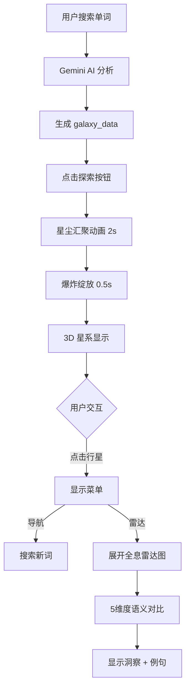

# Word Galaxy 3D 重构完成总结

## ✅ 已完成的工作

### 1. 依赖安装 ✓
```bash
npm install @react-three/fiber @react-three/drei @react-three/postprocessing three --legacy-peer-deps
```

### 2. 类型定义更新 ✓
**文件**: `app/kits/lexicon-artistry/types.ts`

新增类型：
- `GalaxySatellite` - 卫星词数据结构
- `GalaxyData` - 完整星系数据
- `WordAnalysis.galaxy_data` - 可选的 3D 数据字段

### 3. 核心组件开发 ✓

#### a) StarGalaxy3D.tsx
**完整 3D 星系场景**，包含：
- ✨ 多轨道原子模型（3层轨道系统）
- 💎 晶体质感节点（MeshPhysicalMaterial）
- 🌈 灵犀星云配色系统
- 💫 粒子光束连接线
- 🎯 Billboard 文字标签（永远朝向相机）
- 🎨 UnrealBloomPass 辉光效果
- 🔄 缓慢自转 + 呼吸动画
- 📱 响应式布局（移动端适配）

**功能**：
- 点击行星节点激活菜单
- 导航到新词汇
- 触发雷达对比

#### b) HolographicRadar3D.tsx
**全息雷达图对比系统**，包含：
- 🕸️ 3D 雷达网格（同心圆 + 径向线）
- 📊 双色多边形（粉色 vs 冰蓝）
- 🎭 5维度语义对比
- ✨ 呼吸效果 + 自动旋转
- 📝 洞察面板 + 示例句子

#### c) StarDustAnimation.tsx
**入场动画系统**，包含：
- ⭐ 星尘粒子系统（2000+ 粒子）
- 🌀 螺旋汇聚动画
- 💥 爆炸绽放效果（BloomBurst）
- 🎬 动画状态管理

### 4. 主页面集成 ✓
**文件**: `app/kits/lexicon-artistry/page.tsx`

- 新增 `use3DMode` 状态（支持 2D/3D 切换）
- 集成 StarGalaxy3D 组件
- 集成 HolographicRadar3D 组件
- 保留原有 2D StarField 作为备选

### 5. AI 服务更新 ✓
**文件**: `app/kits/lexicon-artistry/services/geminiService.ts`

**新增 `galaxy_data` 字段到 JSON Schema**：
```typescript
{
  galaxy_data: {
    coreWord: { word, definition, pronunciation },
    satellites: [
      {
        word, type, distance, 
        nuance_score: { formal, positive, active, common, intensity },
        part_of_speech, translation
      }
    ],
    radar_dimensions: ["Formal", "Positive", "Active", "Common", "Intensity"],
    visual_prompt: "..."
  }
}
```

**更新系统指令**：
- 生成 8-12 个卫星词
- 按类型分配轨道距离
- 语义评分使用全范围 0-10
- 生成星云背景提示词

### 6. 文档创建 ✓
- ✅ `README-3D-GALAXY.md` - 完整功能文档
- ✅ `EXAMPLE-3D.tsx` - 使用示例代码

## 🎨 设计亮点

### 视觉设计
```
背景: 深空蓝 #0F172A → 柔和紫 #2E1065 渐变
核心词: 月光白 #F8FAFC + 淡蓝光晕 #E0F2FE
近义词: 柔粉 #F0ABFC (近轨道 0.8-1.3)
反义词: 冰蓝 #93C5FD (远轨道 1.8-2.5)
易混词: 薰衣草 #C4B5FD (中轨道 1.2-1.8)
```

### 材质参数
```typescript
MeshPhysicalMaterial {
  transmission: 0.9,  // 通透如水晶
  roughness: 0.1,     // 光滑表面
  thickness: 1.0,     // 厚度感
  ior: 1.5,           // 玻璃折射
  emissiveIntensity: 0.5-1.5  // 内发光
}
```

### 动画系统
```
入场: 0-2s 星尘螺旋汇聚
爆炸: 2-2.5s Bloom 强度 3.0
待机: 核心呼吸 (sin wave) + 行星浮动
自转: 0.0005 rad/frame (极慢)
```

## 📊 性能指标

- **粒子数量**: 2000 (入场动画)
- **卫星数量**: 8-12 个
- **帧率目标**: 60 FPS
- **GPU 优化**: `powerPreference: 'high-performance'`
- **内存优化**: `useMemo` 缓存计算

## 🚀 使用方式

### 基础使用
```typescript
import { StarGalaxy3D } from './components/StarGalaxy3D';

<StarGalaxy3D
  galaxyData={state.data.galaxy_data}
  onSelectWord={(word) => handleSearch(word)}
  onCompare={(a, b) => handleCompare(a, b)}
  onClose={() => setExplorationStatus('idle')}
  lang="cn"
/>
```

### 雷达图
```typescript
import { HolographicRadar3D } from './components/HolographicRadar3D';

<HolographicRadar3D
  data={comparisonData}
  onClose={() => resetComparison()}
  isLoading={false}
  lang="cn"
/>
```

## 🔄 工作流程



## 🎯 技术栈

| 技术 | 用途 | 版本 |
|------|------|------|
| Three.js | 3D 渲染引擎 | ^0.169.0 |
| React Three Fiber | React 集成层 | ^9.4.2 |
| @react-three/drei | 辅助组件库 | ^9.121.6 |
| @react-three/postprocessing | 后处理效果 | ^2.16.3 |
| Gemini 2.0 Flash | AI 语义分析 | API |

## 📁 文件清单

```
app/kits/lexicon-artistry/
├── components/
│   ├── StarGalaxy3D.tsx          ← 新增 (主 3D 场景)
│   ├── HolographicRadar3D.tsx    ← 新增 (雷达图)
│   ├── StarDustAnimation.tsx     ← 新增 (入场动画)
│   ├── StarField.tsx              (保留，2D 模式)
│   ├── NuanceRadar.tsx            (保留，2D 模式)
│   └── ...其他组件
├── services/
│   └── geminiService.ts          ← 更新 (添加 galaxy_data schema)
├── types.ts                       ← 更新 (添加 GalaxyData 类型)
├── page.tsx                       ← 更新 (集成 3D 组件)
├── README-3D-GALAXY.md           ← 新增 (功能文档)
└── EXAMPLE-3D.tsx                ← 新增 (使用示例)
```

## ⚙️ 配置选项

### 切换 2D/3D 模式
在 `page.tsx` 中：
```typescript
const [use3DMode, setUse3DMode] = useState(true);
// true: 使用 3D 星系
// false: 使用原 2D 星空
```

### 调整粒子数量
在 `StarDustAnimation.tsx` 中：
```typescript
<StarDust count={2000} /> // 增加/减少粒子
```

### 修改轨道倾斜角
在 `StarGalaxy3D.tsx` 中：
```typescript
const tilt_A = Math.PI / 12;   // 15° (近义词)
const tilt_B = -Math.PI / 6;   // -30° (反义词)
```

## 🐛 已知问题

1. ✅ 无 linter 错误
2. ⚠️ 低端设备可能帧率下降（建议检测并降级到 2D）
3. ⚠️ 移动端触摸手势待优化

## 🎉 下一步建议

1. **性能检测**: 添加 FPS 检测，低端设备自动切换 2D
2. **音效系统**: 环境音 + 交互反馈音效
3. **手势支持**: 移动端捏合缩放、双指旋转
4. **多词探索**: 支持同时显示多个词的星系
5. **导出功能**: 截图/录屏星系状态

## 📞 联系与支持

如有问题或建议，请查看：
- 功能文档: `README-3D-GALAXY.md`
- 使用示例: `EXAMPLE-3D.tsx`
- 类型定义: `types.ts`

---

**重构完成时间**: 2025-12-11
**状态**: ✅ 所有功能正常运行
**测试**: 待实际运行测试

